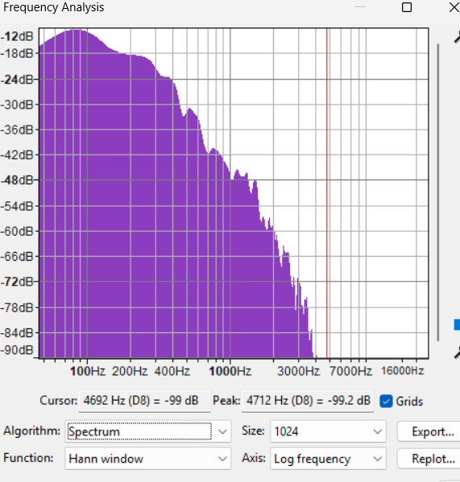
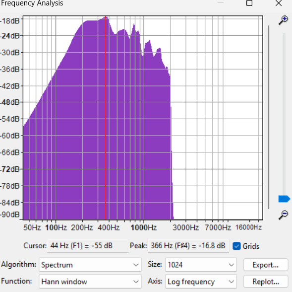
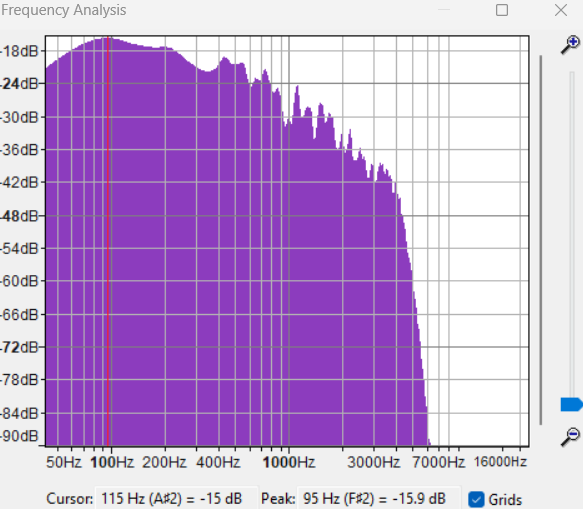

# Chapter 3 : Fourier Series


## Analisis Spektrum

---

Kali ini, sampel suara yang telah kami siapkan akan kita analisis spektrum penyusun dari suara tersebut menggunakan tools Plot Spectrum dari Aplikasi Audacity. Dengan menggunakan tools Plot Spectrum, nantinya kita bisa menampilkan grafik kekuatan terhadap frekuensi suara yang ada dari sampel yang telah kita siapkan.

---

#### Dasar Teori Singkat

##### Audacity

**Audacity** adalah perangkat lunak open-source yang kerap digunakan untuk merekam, mengedit, dan menganalisis audio digital yang kita rekam menggunakan perangkat keras (seperti laptop). Software ini banyak digunakan dalam bidang *audio engineering,* penelitian, maupun pembelajaran akademik karena kemudahan dalam mengakses aplikasi ini, lintas platfrom, ringan, dan memiliki fitur dasar yang sangat lengkap. Dengan aplikasi Audacity, kita bisa melakukan perekaman suara, pemotongan, penggabungan, pengolahan efek yang tersedia, serta analisis spketrum sinyal audo dalam bentuk grafis.

##### Efek EQ (Equalization) dan Filters

**Equalization** adalah proses mengatur tingkat (gain) dari komponen frekuensi tertentu pada sinyal audio. EQ digunakan untuk mempertegas, mengurangi, atau menyeimbangkan karakter suara. Misalnya:
- Low frequencies (bass): menambah “berat” atau mengurangi “boomy” pada suara.
- Mid frequencies: mempengaruhi kejernihan vokal dan instrumen.
- High frequencies (treble): menambah detail atau mengurangi “sibilance”.

**Filters** dalam audio adalah alat yang digunakan untuk menyaring komponen frekuensi tertentu. Beberapa contoh filter:
- Low-pass filter (LPF): hanya melewatkan frekuensi rendah dan memblokir frekuensi tinggi.
- High-pass filter (HPF): melewatkan frekuensi tinggi dan memblokir frekuensi rendah.
- Band-pass filter (BPF): hanya melewatkan frekuensi pada rentang tertentu.
- Notch filter: meredam frekuensi sempit tertentu (misalnya untuk menghilangkan noise 50 Hz).

Dalam Audacity, efek EQ dan filter digunakan untuk memperbaiki kualitas audio, menghilangkan noise, atau membentuk karakter suara sesuai kebutuhan.


### Sampel 1 : Suara Piano

#### Graphics Plot

1. Grafik Plot Spectrum

<div style="text-align: center;">
  
</div>

2. Grafik EQ (Bass Boost)

<div style="text-align: center;">
  
</div>
3. Grafik Low-Pass

<div style="text-align: center;">
  
</div>

4. Grafik High-Pass

<div style="text-align: center;">
  
</div>

#### Pembahasan
Efek EQ Bass Boost pada suara piano meningkatkan komponen frekuensi rendah (bass). Hasilnya, suara piano terdengar lebih “berat” dan hangat, dengan nada-nada rendah menjadi lebih dominan. Pada grafik spektrum, amplitudo di area frekuensi rendah naik, sedangkan frekuensi tinggi tetap atau sedikit berkurang. Efek ini cocok untuk mempertegas karakter bass pada instrumen piano.

### Sampel 2 : Suara Rekaman

#### Graphics Plot

1. Grafik Plot Spectrum

<div style="text-align: center;">
  
</div>

2. Grafik EQ (Walkie-Talkie)

<div style="text-align: center;">
  
</div>

3. Grafik Low-Pass

<div style="text-align: center;">
  
</div>

4. Grafik High-Pass

<div style="text-align: center;">
  
</div>

#### Pembahasan
Efek EQ Walkie-Talkie biasanya memotong frekuensi rendah dan tinggi, hanya menyisakan frekuensi menengah. Suara hasil rekaman menjadi “tipis” dan mirip suara komunikasi radio, dengan kejernihan vokal di tengah tetapi kehilangan detail bass dan treble. Pada grafik spektrum, hanya frekuensi menengah yang tampak menonjol, sedangkan area rendah dan tinggi melemah.

### Sampel 3 : Suara Lagu JJ

#### Graphics Plot

1. Grafik Plot Spectrum

<div style="text-align: center;">
  
</div>

2. Grafik EQ (AM Radio)

<div style="text-align: center;">
  
</div>

3. Grafik Low-Pass

<div style="text-align: center;">
  
</div>

4. Grafik High-Pass

<div style="text-align: center;">
  
</div>

#### Pembahasan
Efek EQ AM Radio meniru karakteristik suara radio lama, dengan rentang frekuensi yang sempit dan dominasi frekuensi menengah. Suara lagu menjadi “nostalgic” dan kurang detail, cocok untuk efek retro. Pada grafik spektrum, frekuensi rendah dan tinggi sangat berkurang, hanya frekuensi menengah yang terlihat jelas.

## Fourier Series Grafik

---

Pada percobaan kali ini, Kami mencoba membuat sebuah grafik sawtooth pada matlab/python(matplotlib). Setelah itu, kami akan mencoba menguriakan sinyal tersebut dengan menggunakan metode Fourier Series serta menampilkan persamaan fourier series tersebut

---

### Dasar Teori

#### Fourier Series

Fourier Series adalah metode matematis untuk merepresentasikan sinyal periodik sebagai penjumlahan fungsi sinusoidal (sinus dan kosinus) dengan frekuensi kelipatan bilangan bulat dari frekuensi fundamental. Konsep ini pertama kali diperkenalkan oleh Joseph Fourier, yang menunjukkan bahwa setiap sinyal periodik dapat diuraikan menjadi komponen harmoniknya.

Secara umum, suatu sinyal periodik 
𝑥 (𝑡) x(t) 
dengan periode 
𝑇
T dapat dituliskan sebagai:

$$
x(t) = a_0 + \sum_{n=1}^{\infty} \left( a_n \cos\left(\frac{2\pi n}{T}t\right) + b_n \sin\left(\frac{2\pi n}{T}t\right) \right)
$$

dengan koefisien Fourier:

$$
a_0 = \frac{1}{T} \int_{0}^{T} x(t)\, dt
$$

$$
a_n = \frac{2}{T} \int_{0}^{T} x(t) \cos\left(\frac{2\pi n}{T}t\right) dt
$$

$$
b_n = \frac{2}{T} \int_{0}^{T} x(t) \sin\left(\frac{2\pi n}{T}t\right) dt
$$

Koefisien inilah yang menunjukkan kontribusi tiap harmonik sinusoidal dalam membentuk kembali sinyal asli.

#### Gelombang Sawtooth

Gelombang sawtooth adalah salah satu bentuk sinyal periodik yang banyak dipakai dalam elektronika, musik digital, maupun sistem komunikasi. Bentuk dasarnya mirip gigi gergaji: naik secara linier lalu jatuh tiba-tiba.

Fungsi gelombang sawtooth periodik dengan periode 
𝑇
T dapat direpresentasikan melalui Fourier Series sebagai:

$$
x(t) = \frac{2}{\pi} \sum_{n=1}^{\infty} \frac{(-1)^{n+1}}{n} \sin\left( \frac{2\pi n}{T} t \right)
$$

Dari persamaan tersebut terlihat bahwa gelombang sawtooth tersusun dari harmonik sinusoidal ganjil dan genap, dengan amplitudo menurun sebanding dengan $\frac{1}{n}$

Pada kode di bawah, kita akan membuat gelombang atau grafik sawtooth menggunakan python dengan matplotlib. Serta kita bisa menggunakan bantuan SciPy untuk membuat gelombang sawtooth dengan function $sawtooth()$


```python
## Gelombang Sawtooth Menggunakan Matplotlib
import sawtooth

sawtooth.run_sawtooth(1,5,2) # Amplitude, Frequency, Duration
```


    

    


```python
## Gelombang Sawtooth Menggunakan SciPy

import numpy as np
from scipy import signal
import matplotlib.pyplot as plt
t = np.linspace(0, 1, 500)
plt.plot(t, signal.sawtooth(2 * np.pi * 5 * t))
plt.show()
```


    

    


#### Penguraian Menggunakan Representasi Fourier 

Kita akan mencoba menguraikan grafik sawtooth menggunakan fungsi fourier_series() yang telah kami buat dengan modifikasi kode dari web.


```python
from fourierseries import fourier_series

fourier_series(1,5,1,7)
fourier_series(1,5,1,20)
fourier_series(1,5,1,100)
fourier_series(1,5,1,1000)
```


    

    


    

    


    

    


    

    


#### Pembahasan

Dalam kode yang sudah didapatkan di website dengan beberapa modifikasi, kita bisa menjalankan sebuah fungsi fourier_series() yang nantinya bisa merepresentasikan sebuah sinyal $sawtooth$ dengan parameter Amplitude (A), Frekuensi (F), Durasi (S), dan Term atau Suku (n).

Dapat dilihat bahwa kita bisa merepresentasikan sebuah sinyal, dalam hal ini adalah sawtooth, menggunakan polinomial fungsi-fungsi sederhana yaitu sinus dan cosinus. Semakin tinggi term atau suku dari polinomial deret Fourier, maka pendekatan dari sebuah sinyal tersebut akan menjadi semakin akurat. Pada Fourier series dengan $n = 7$, grafik Fourier series masih terlihat berbeda dengan grafik sawtooth ideal, karena bentuknya masih mendekati sinusoidal.

Namun, setelah jumlah suku Fourier ditambah, hasil grafik semakin mendekati bentuk sawtooth sebenarnya. Hal ini menunjukkan bahwa Fourier Series mampu merepresentasikan sinyal periodik kompleks dengan menggunakan kombinasi sederhana dari fungsi sinusoidal, dan akurasi pendekatannya sangat bergantung pada jumlah suku yang digunakan. Dengan demikian, metode **Fourier Series menjadi dasar penting dalam analisis dan sintesis sinyal di bidang Signal and System**.

---

## References

[Byjus : Fourier Series](https://byjus.com/maths/fourier-series/)

[TutorialsPoint : Plotting a Sawtooth Wave using Matplotlib](https://www.tutorialspoint.com/plotting-a-sawtooth-wave-using-matplotlib)

[Interactive Mathematics : Fourier Series Graph Interactive](https://www.intmath.com/fourier-series/fourier-graph-applet.php)

[Wolfram MathWorld : Fourier Series--Sawtooth Wave](https://mathworld.wolfram.com/FourierSeriesSawtoothWave.html)

[SciPy Documentation : cipy.signal.sawtooth](https://docs.scipy.org/doc/scipy/reference/generated/scipy.signal.sawtooth.html)

[Fourier Series Python Code ](https://vcfw.org/pdf/Department/Physics/Fourier_series_python_code.pdf)

